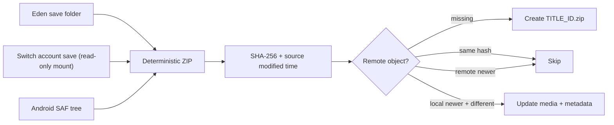

# NXSync architecture

## Cloud object contract

Each title maps to exactly one Drive filename:

```text
0100F2C0115B6000.zip
```

The archive contains the save directory's children at its root. It never
contains the `<TITLE_ID>` directory itself. All clients use the same
`appProperties`, so Drive's server timestamp is not mistaken for the source
save timestamp.



## Desktop flow

1. Locate and parse `qt-config.ini`.
2. Resolve the NAND or custom title-save root.
3. Enumerate 16-hex-digit title directories and recursively register filesystem
   notifications. Newly created title directories are registered dynamically.
4. Debounce a write burst for two seconds.
5. Build the archive in a private temporary file.
6. Query Drive by exact filename and compare source metadata.
7. Create/update only when the local save wins the conflict rule.

The sync engine depends on a small `RemoteStore` interface. This keeps cloud
transport testable and prevents UI/platform code from leaking into conflict
logic.

## Switch flow

```mermaid
sequenceDiagram
    participant PM as "pm:shell"
    participant SYS as "sys-savesync"
    participant FS as "Account save"
    participant GD as "Google Drive"
    PM-->>SYS: "Application Start(pid)"
    SYS->>PM: "Resolve pid → Title ID"
    PM-->>SYS: "Matching Application Exit(pid)"
    SYS->>SYS: "active=0; queue last Title ID"
    loop "until connected"
        SYS->>SYS: "Check nifm"
    end
    SYS->>FS: "Mount save read-only"
    FS-->>SYS: "ZIP + SHA-256"
    SYS->>GD: "Refresh OAuth token"
    SYS->>GD: "Find TITLE_ID.zip"
    SYS->>GD: "Resumable create/update if newer"
```

The overlay never calls Drive or mounts saves. It writes a small command file
atomically; the sysmodule is the only owner of synchronization state. Status is
published with the same temporary-file-and-rename pattern.

## Pull safety

Downloads are path-validated to reject absolute paths, backslashes, and `..`.
Desktop pulls extract into a staging directory. Switch pulls are deferred until
there is no active application. Before any files are changed, the sysmodule
creates `/config/savesync/rollback-<TITLE_ID>.zip`. If extraction or commit
fails, it automatically reapplies that archive. The latest rollback is retained
on the SD card after a successful restore for manual recovery.

## Authentication

- Desktop uses installed-app OAuth, PKCE, a loopback redirect, and an offline
  refresh token.
- Android uses Google Identity Services and requests an access token silently
  in `WorkManager` after foreground consent.
- Switch refreshes an already issued token directly. It has no embedded browser
  or keyboard flow.

All clients request `drive.file`, not broad Drive access.

## Known integration boundaries

- Real game saves can be account saves or device saves. The current Switch
  implementation handles account saves for the last opened user; a device-save
  fallback can be added through `fsdevMountDeviceSaveData`.
- Eden builds may change key names. The parser intentionally recognizes the
  common normalized names while ignoring unrelated sections.
- Google OAuth client IDs and Android signing identities belong to the release
  operator. They cannot be inferred at runtime.
